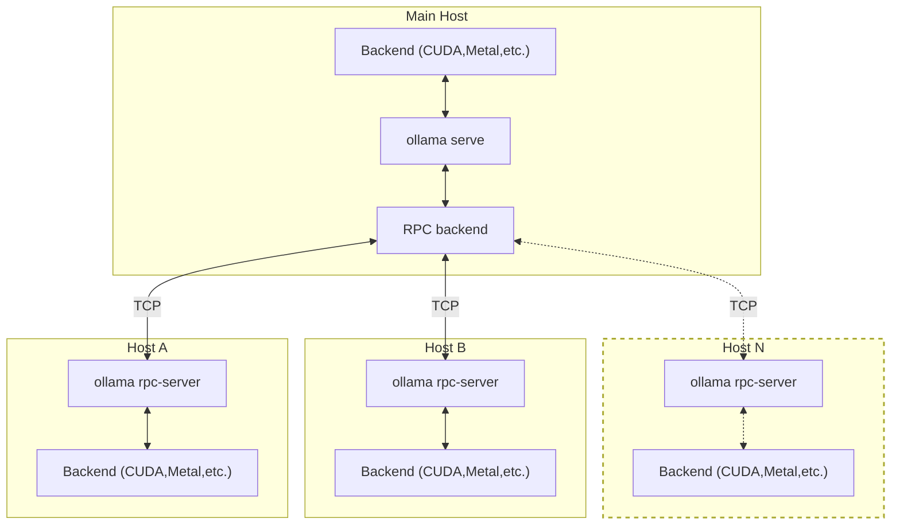

# RPC Server for Distributed Inferencing

Ollama now includes an integrated RPC server for distributed inferencing, allowing you to run models across multiple machines without needing to build and run a separate RPC server application.

## Overview

The RPC server allows running `ggml` backend on a remote host. The RPC backend communicates with one or several instances of the RPC server and offloads computations to them. This can be used for distributed LLM inference with Ollama.



Each host can run a different backend, e.g., one with CUDA and another with Metal. You can also run multiple RPC server instances on the same host, each with a different backend.

## Usage

### Starting an RPC Server

On each host that will participate in distributed inferencing, start the RPC server:

```bash
ollama rpc-server
```

By default, the RPC server binds to `127.0.0.1:50052`. You can customize the host and port:

```bash
ollama rpc-server -H 0.0.0.0 -p 50053
```

> [!IMPORTANT]
> Never expose the RPC server to an open network or in a sensitive environment! This feature is experimental and not secure.

### Command Line Options

- `-H, --host`: Host to bind to (default: "127.0.0.1")
- `-p, --port`: Port to bind to (default: 50052)
- `-m, --mem`: Backend memory size in MB (optional)

### Using RPC Servers with Ollama

Once you have RPC servers running on various hosts, you can use them with Ollama by setting the `OLLAMA_RPC_SERVERS` environment variable:

```bash
OLLAMA_RPC_SERVERS="192.168.1.10:50052,192.168.1.11:50053" ollama serve
```

This will make Ollama automatically offload model layers to the specified RPC servers.

You can also specify RPC servers for individual requests:

```bash
curl http://localhost:11434/api/generate --json '{
  "model": "llama3.1",
  "prompt": "hello",
  "stream": false,
  "options": {
    "rpc_servers": "192.168.1.10:50052,192.168.1.11:50053"
  }
}'
```

## GPU Selection

When using the CUDA backend, you can specify the device with the `CUDA_VISIBLE_DEVICES` environment variable:

```bash
CUDA_VISIBLE_DEVICES=0 ollama rpc-server
```

This way, you can run multiple RPC server instances on the same host, each with a different CUDA device.

## Troubleshooting

If Ollama is having issues connecting to your RPC servers, make sure:

1. The RPC server is running and accessible from the Ollama server
2. There are no firewalls blocking the connection
3. The RPC server version matches the Ollama version

## Security Considerations

The RPC server functionality is currently in a proof-of-concept development stage. As such, the functionality is fragile and insecure. **Never run the RPC server on an open network or in a sensitive environment!**